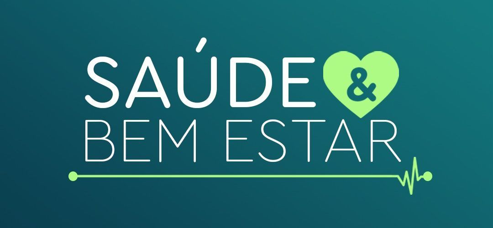

# bootcamp-framework-padawans

 
     

## 🧪 Tecnologias

Esse projeto foi desenvolvido usando as seguintes tecnologias:

- [Visualg](https://visualg3.com.br/)

## 🚀 Sobre o projeto

### Saúde e Bem-estar

- Qual o problema?

A falta de planejamento familiar que acaba gerando gravidez precoce. A falta de informação no geral em escolas, farmácias, no núcleo familiar, televisão, internet etc...

- Solução

Garantir o acesso a informação sobre o métodos modernos sobre planejamento familiar.

Promover campanhas em pontos específicos para conseguir expandir a conscientização sobre a importância de saúde sexual mais alinhada com a sua própria realidade.

Criar uma aplicação com informações cruciais sobre a saúde sexual e reprodução, aonde quem iria ter acesso seria as pessoas que trabalham nas UBS, que seriam as agentes sociais, e assim iriamos capacitar essas pessoas para poder conseguir repassar isso a quem não tem essas informações.

Visando criar algo acessível mesmo off-line, os mentores irão ensinar como entrar no site através do Google Chrome sem precisar de internet para que os usuários possam acessar  as informações sempre que precisarem.

## 📝 License

Esse projeto está sob a licença MIT. Veja o arquivo [LICENSE](LICENSE.md) para mais detalhes.
